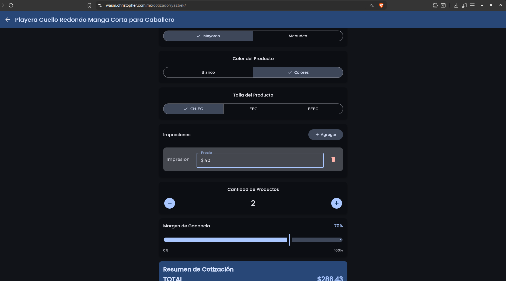

# Cotizador (Kotlin Multiplatform)

Proyecto Kotlin Multiplatform basado en Compose Multiplatform que contiene una aplicación llamada `composeApp` con targets para Android y Web (WASM y JS).

Resumen
- Nombre: Cotizador
- Tipo: Aplicación multiplataforma (Android + Web)
- Tecnologías principales: Kotlin Multiplatform, Jetpack Compose / Compose Multiplatform, Kotlin/Wasm, Gradle

Qué se utilizó
- Kotlin Multiplatform: para compartir lógica y UI entre plataformas.
- Compose Multiplatform: para construir la interfaz declarativa (UI) en Android y Web.
- Kotlin/Wasm y JS targets: para desplegar la versión web (WASM recomendado por rendimiento moderno; JS para navegadores más antiguos).
- Gradle (Kotlin DSL): sistema de compilación y ejecución (archivos `build.gradle.kts`, `settings.gradle.kts`).
- Webpack: configuración incluida en `webpack.config.d/` para empaquetar la app web.

Qué se hizo en el proyecto
- Estructuración del módulo `composeApp` con código compartido en `commonMain` y código específico de plataforma en carpetas como `androidMain`, `jsMain`, `wasmJsMain`, etc.
- Configuración de targets multiplataforma (Android, WASM, JS) y tareas de Gradle para build/run.
- Inclusión de recursos y assets generados para web y Android (carpeta `build/` con outputs procesados).

Estructura importante
- `composeApp/src/commonMain/kotlin` — código compartido entre plataformas.
- `composeApp/src/androidMain` — código específico para Android.
- `composeApp/src/jsMain` y `composeApp/src/wasmJsMain` — código y adaptaciones para Web (JS / WASM).
- `webpack.config.d/` — ajustes de empaquetado para la versión web.

Sección principal / Página web
La página principal del proyecto debe apuntar a la versión web de la aplicación. Puedes publicar o servir la build web y luego compartir la URL aquí.

- URL de la página principal: https://wasm.christopher.com.mx/cotizador/yazbek/

Instrucciones para desarrollar y ejecutar

Requisitos básicos locales
- JDK 11+ (o la versión requerida por el proyecto). Verifica `gradle.properties` / `build.gradle.kts` si hay una versión específica.
- Gradle Wrapper incluido (usa `./gradlew` o `gradlew.bat`).

Build y ejecución — Android
- Desde Linux/macOS:

  ./gradlew :composeApp:assembleDebug

- Desde Windows:

  .\gradlew.bat :composeApp:assembleDebug

Esto compilará el APK de debug en `composeApp/build/outputs/apk/`.

Build y ejecución — Web
- Target WASM (recomendado, navegadores modernos):

  ./gradlew :composeApp:wasmJsBrowserDevelopmentRun

- Target JS (para compatibilidad con navegadores antiguos):

  ./gradlew :composeApp:jsBrowserDevelopmentRun

Notas:
- Las tareas `*BrowserDevelopmentRun` inician un servidor de desarrollo y abren la aplicación en el navegador por defecto.
- Si necesitas generar una build de producción para desplegar en un servidor estático, revisa las tareas disponibles en Gradle (por ejemplo, `assemble` o tareas relacionadas con `browserProductionWebpack` dependiendo de la configuración del proyecto).

Cómo cambiar la página principal para redirigir al sitio web
- Si la intención es que la página principal del repositorio apunte a la web alojada, actualiza el enlace de la sección "Sección principal / Página web" con la URL definitiva.
- Para la app web, si quieres que el primer componente muestre un enlace externo, edita el punto de entrada web en `composeApp` (usualmente en `webMain` / `wasmJsMain` / `jsMain`) para que el componente inicial renderice un botón o realice una redirección.

Sugerencia de componente de entrada (concepto):
- Agrega en tu punto de entrada web una pantalla de bienvenida con un botón "Abrir versión web" que abra la URL externa en una nueva pestaña. Esto facilita dirigir a los usuarios al sitio principal.

Pruebas y calidad
- El proyecto incluye directorios de pruebas para los distintos targets (revisa `composeApp/src/*Test*` si hay tests).
- Recomendación: añadir pruebas unitarias en `commonTest` para la lógica compartida, y pruebas UI/integ. en los targets específicos según necesidades.

Errores conocidos y soluciones comunes
- Problemas con versiones de JDK/Gradle: verifica la versión usada en `gradle-wrapper.properties` y `gradle.properties`.
- Dependencias del navegador/WASM: asegúrate de usar navegadores modernos para WASM y limpiar caches de Gradle/webpack si ves errores extraños (`./gradlew clean` y borrar caches del navegador).

Contribuir
- Explica brevemente cómo contribuir: abrir issues, enviar pull requests, mantener estilo de código con Kotlin coding conventions.

Contacto y feedback
- Si quieres recibir feedback sobre Compose/Web o Kotlin/Wasm puedes participar en canales públicos (por ejemplo, `#compose-web` en Slack de Kotlin) o abrir issues en el repositorio.